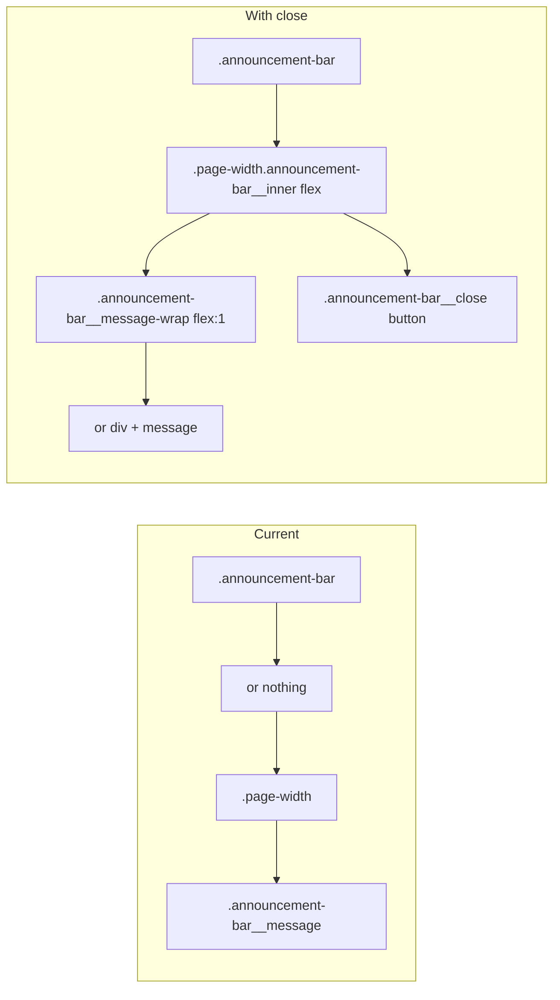

# Add close (X) button to announcement bar

## Current behaviour

- [sections/announcement-bar.liquid](sections/announcement-bar.liquid) outputs one `.announcement-bar` per block (up to 12). Each bar can have optional link, text, color, and alignment.
- The whole bar is wrapped in an `<a>` when `block.settings.link` is set; content lives in `.page-width` with a single `
`.
- Styles live in [assets/base.css](assets/base.css) (`.announcement-bar`, `.announcement-bar__link`, `.announcement-bar__message`).

## Approach

1. **Layout**
  - Restructure so the bar has a flex row: one flex child for the message (and its optional link), and a second for the close button on the far right.
  - The close button must be **outside** the `<a>` (valid HTML and so clicking X does not follow the link). So the first flex child is a wrapper (e.g. `.announcement-bar__message-wrap`) containing either the existing `<a>` or a plain div, plus the `
`. The second flex child is the close button.
2. **Close button**
  - Use the existing [snippets/icon-close.liquid](snippets/icon-close.liquid) and the theme’s `aria-label="{{ 'accessibility.close' | t }}"` pattern (as in cart-drawer, modal close buttons, etc.).
  - `<button type="button" class="announcement-bar__close" aria-label="{{ 'accessibility.close' | t }}"></button>`.
3. **Persistence**
  - Use `localStorage` with a key per bar, e.g. `announcement-bar-dismissed-{{ section.id }}-{{ block.id }}`, so each bar can be dismissed independently and stays closed across pages and visits.
  - On load: if the key is set, hide that bar (e.g. `display: none` or a class).
  - On close click: set the key, then hide the bar.
4. **Styling**
  - Add a small block of section-scoped CSS (in the section file) for the new layout and button so the change is self-contained:
    - `.announcement-bar__inner` (or reuse `.page-width` with a modifier): `display: flex; align-items: center;`.
    - `.announcement-bar__message-wrap`: `flex: 1 1 auto; min-width: 0;` so the message can shrink and alignment (left/center/right) still applies within the remaining space.
    - `.announcement-bar__close`: flex-shrink: 0, padding, and a hover state so it’s clearly tappable/clickable.
  - Alternatively, these rules can go in [assets/base.css](assets/base.css) if you prefer to keep all announcement-bar styles there.
5. **Script**
  - Inline script at the end of the section (only when `show_bar` is true): on DOMContentLoaded, for each bar with `data-announcement-bar-id`, check localStorage and hide if dismissed; delegate one click listener to handle `.announcement-bar__close` (set localStorage, hide that bar). No new asset file required.

## Structure change (conceptual)

## Files to touch

| File                                                                 | Change                                                                                                                                                                                            |
| -------------------------------------------------------------------- | ------------------------------------------------------------------------------------------------------------------------------------------------------------------------------------------------- |
| [sections/announcement-bar.liquid](sections/announcement-bar.liquid) | Wrap content in a flex container; add message-wrap div; add close button with `data-announcement-bar-id` on the bar; add `<style>` for new classes; add inline script for dismiss + localStorage. |
| [assets/base.css](assets/base.css) (optional)                        | If you prefer not to use a `<style>` block in the section, move the new announcement-bar layout/close rules here.                                                                                 |

## Optional enhancement

- **Setting “Show close button”** in the section or block schema (default true), so merchants can hide the X for specific announcements. Omitted from the plan for simplicity; can be added later.

## Summary

- One X per announcement block, on the far right.
- Uses existing `icon-close` and `accessibility.close` translation.
- Dismissal is stored in localStorage per bar and persists across pages.
- Layout and script are contained in the section; optional move of CSS to `base.css` if desired.

